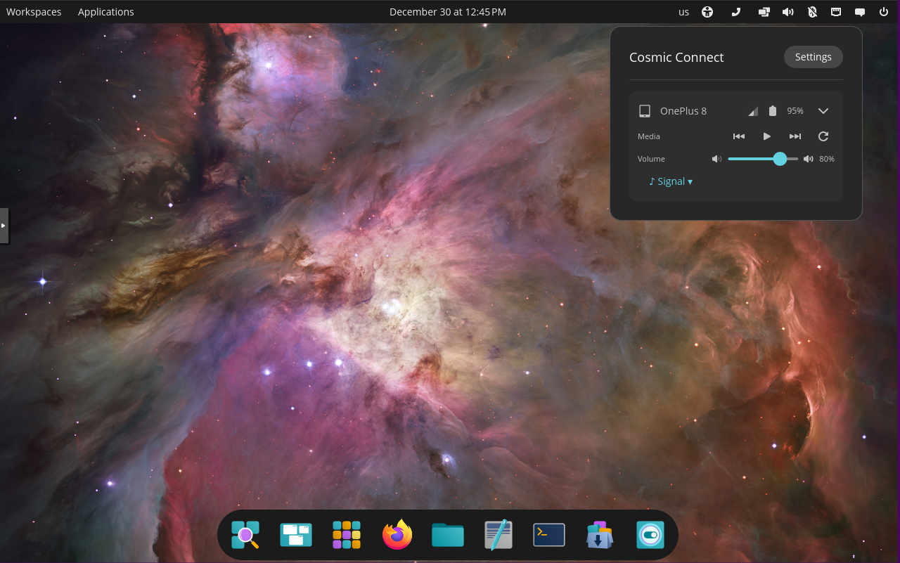
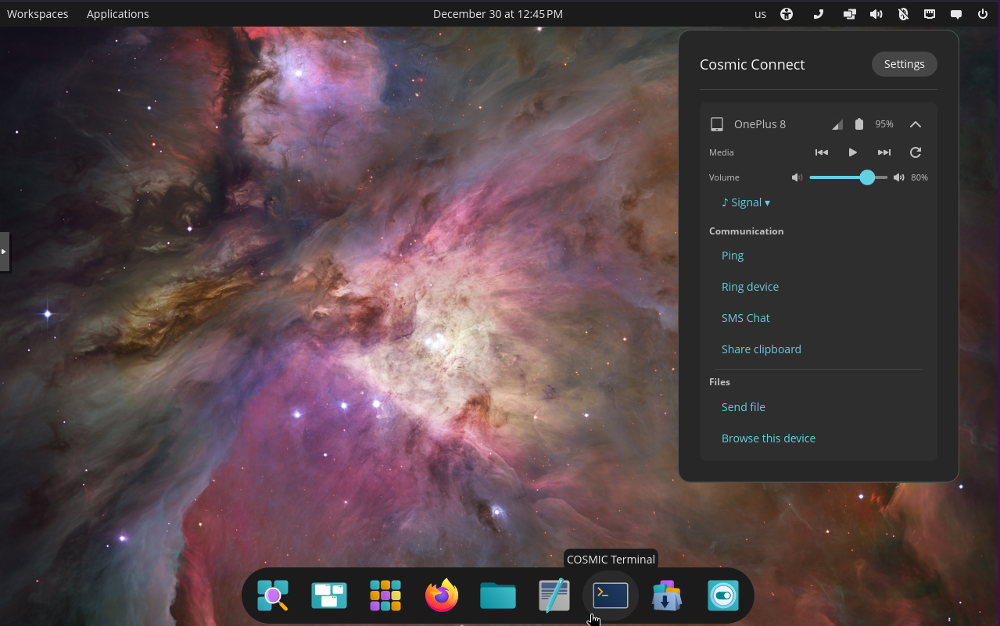
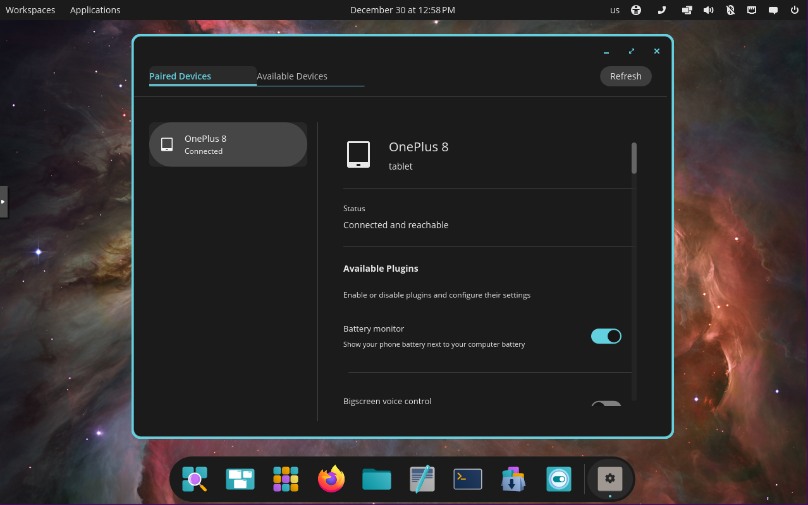
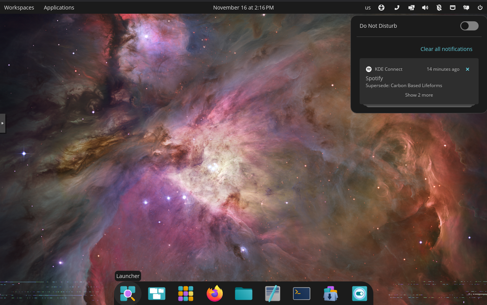
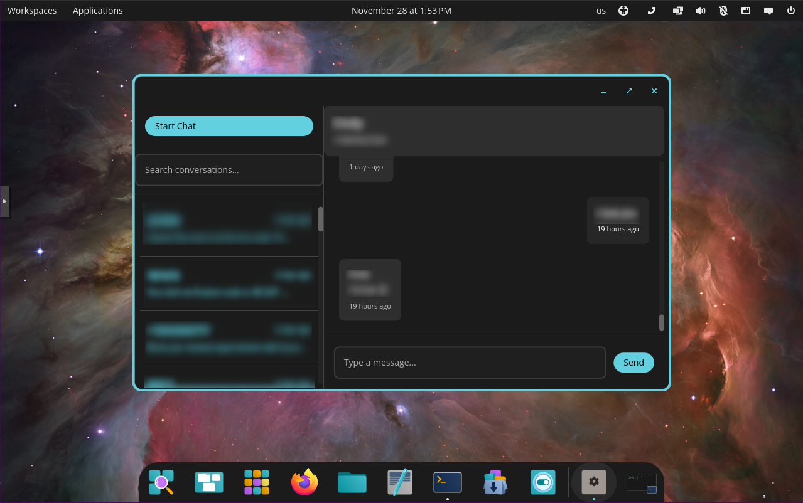

# Cosmic Connect
Native KDE Connect integration for the COSMIC desktop environment.

**This is just hobby project. Use at your own risk. Expect bugs.**

## Screenshots

<details>
<summary>Click to view screenshots</summary>

<p align="center">
  
  <br><em>Main Applet View</em>
</p>

<p align="center">
  
  <br><em>Applet Options Menu</em>
</p>

<p align="center">
  
  <br><em>Plugin Permissions & Configuration</em>
</p>

<p align="center">
  
  <br><em>Android Notifications</em>
</p>

<p align="center">
  
  <br><em>SMS Messaging</em>
</p>

</details>

## Overview

Cosmic Connect provides seamless Android device integration for COSMIC desktop users through native applications that replace KDE Connect's Qt-based interfaces. While maintaining full compatibility with KDE Connect's D-Bus APIs and configuration, it delivers a consistent COSMIC desktop experience.

**Key Components:**
- **System Applet** - Device management, media controls, file sharing, and quick actions
- **Settings Application** - Device pairing and plugin configurations.
- **SMS Application** - Text messaging with connected Android devices

## Features

- **Device Management** - Connect, pair, and manage Android devices
- **Media Controls** - Control media playback with multi-player support (MPRIS)
- **File Sharing** - Send and receive files between devices
- **SMS Messaging** - Full conversation view and message handling
- **Clipboard Sync** - Share clipboard content across devices
- **Notifications** - View and interact with Android notifications
- **Remote Commands** - Execute custom commands on connected devices
- **Device Actions** - Ping, lock, and find your phone
- **Battery Status** - Monitor device battery levels
- **Cellular Signal** - View signal strength indicators
- **Browse Device** - Browse device files (KDE Connect android app needs permission to access files which does not seem available by default on some devices.)

All features work through KDE Connect's D-Bus interface, requiring KDE Connect daemon to be installed and running.

## Requirements

### System Requirements
- COSMIC desktop environment
- KDE Connect daemon (`kdeconnect` package)
- KDE Command Line Tools (`kde-cli-tools` package)
- Zenity File Picker (`zenity` package)
- CLI Clipboard (`wl-clipboard` package)
- Rust toolchain (for building from source)

## Installation on PopOS

**Clone the repository:**
   ```bash
   git clone https://github.com/M4L-C0ntent/Cosmic-Connect.git
   cd cosmic-connect
   ```

**Install Required Package Dependencies**
   ```bash
   sudo ./install.sh
   ```


### Build and Install

1. **Install Just:**
   ```bash
   sudo apt install just
   ```


3. **Install Dependancies:**
   ```bash
   sudo just install-deps
   ```

4. **Build and install:**
   ```bash
   just build-release
   sudo just install
   ```

This will:
- Build release binaries
- Install to `/usr/local/bin/`
- Install desktop files
- Register as handler for pairing notifications
- Restart the COSMIC panel

### Update Installation

```bash
git pull
just build-release
sudo just install
```


## Usage

### Adding the Applet to Your Panel

After installation, you need to add Cosmic Connect to your COSMIC panel:

1. Open the **COSMIC Settings** application
2. Navigate to the **"Desktop"** section, then select **"Desktop and Panels"**
3. Locate the section for managing applets on the Panel or Dock
4. Click on **"Add applets"** to open a list of available applets
5. Find and select **"Cosmic Connect"** from the list
6. Click to add it to the panel
7. The applet icon will appear on your panel

**Note:** If the applet doesn't appear in the list immediately, you may need to log out and log back in, or restart your COSMIC session. You can rearrange the applet's position by dragging it within the settings.

### Accessing Settings

Once the applet is in your panel, click on it to access:
- Device management
- Quick actions (ping, find phone, etc.)
- Media controls
- File sharing

To configure devices and plugins:
- Click the settings icon in the applet popup, **OR**
- Launch **"Cosmic Connect Settings"** from the COSMIC applications menu

### Pairing Devices

1. Ensure KDE Connect is running on both your computer and Android device
2. Open Cosmic Connect Settings (from the applet or applications menu)
3. Your Android device should appear in the device list
4. Click **"Request Pair"** and accept the pairing request on your phone
5. Once paired, configure which plugins you want to enable


## Uninstall

### For Direct Installation
```bash
sudo just uninstall
```

## Contributing

Contributions are welcome! 

## Credits

Built for the COSMIC desktop environment using:
- [libcosmic](https://github.com/pop-os/libcosmic) - COSMIC toolkit
- [KDE Connect](https://kdeconnect.kde.org/) - Device integration protocol
- [zbus](https://github.com/dbus2/zbus) - D-Bus communication

## Related Projects

- [KDE Connect](https://invent.kde.org/network/kdeconnect-kde) - Original KDE Connect implementation
- [COSMIC Desktop](https://github.com/pop-os/cosmic-epoch) - Desktop environment
- [Valent](https://valent.andyholmes.ca/) - GNOME KDE Connect client (protocol reference)

## Disclaimer
This project is developed for personal learning and experimentation. It is not intended for production use. The author makes no representations or warranties of any kind, express or implied, about the completeness, accuracy, reliability, suitability, or availability with respect to the project or the information, products, services, or related graphics contained on the project for any purpose. Any use of this project is at your own risk.

## Note on AI Use
AI tools were used as part of the learning and experimentation process—particularly for code suggestions and documentation support. This remains a personal hobby project.